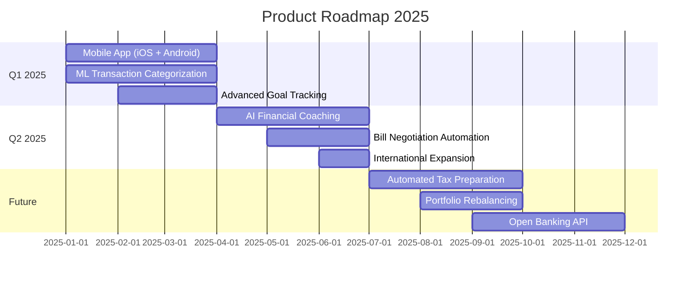

<div align="center">

# 🐜 Ant Finance

### Your Wealth. Your Community. Always Free.

**Building wealth through financial transparency and community.**

[](https://antfinance.app)
[](https://reddit.com/r/antfinance)
[](https://discord.gg/antfinance)


</div>

---

## 💡 What We're Building

Ant Finance is a **free, community-driven financial intelligence platform** that connects all your accounts in one secure place. Track your net worth, compare progress with peers anonymously, and grow wealth alongside thousands of members.

<table>
  <tr>
    <td align="center">🔒</td>
    <td><strong>Bank-Level Security</strong></td>
    <td align="center">📊</td>
    <td><strong>Real-Time Tracking</strong></td>
  </tr>
  <tr>
    <td align="center">🏆</td>
    <td><strong>Peer Benchmarking</strong></td>
    <td align="center">💯</td>
    <td><strong>Forever Free</strong></td>
  </tr>
</table>

---

## 🚀 Core Features

<table>
<tr>
<td width="50%">

### 📊 Complete Financial Dashboard
Real-time net worth tracking across all your accounts with beautiful visualizations

</td>
<td width="50%">

### 🔗 Secure Account Aggregation
Connect banks, credit cards, loans, investments via Plaid's industry-leading API

</td>
</tr>
<tr>
<td width="50%">

### 📈 AI-Powered Insights
Smart analytics that identify savings opportunities and help you save $150+/month

</td>
<td width="50%">

### 🏆 Colony Leaderboard
Anonymous peer benchmarking for motivation without compromising privacy

</td>
</tr>
<tr>
<td colspan="2">

### 🔒 Bank-Level Security
256-bit encryption • Read-only access • Zero-knowledge architecture • SOC 2 Type II compliant

</td>
</tr>
</table>

---

## 💻 Tech Stack

<details>
<summary><strong>Click to expand tech stack</strong></summary>

### Frontend


- Shadcn/ui component library
- Recharts for data visualization
- React Router v6

### Backend


- Cloud Functions (serverless)
- Plaid API for financial data
- JWT authentication
- Cloud Storage for assets

### Security & Compliance
```
✅ End-to-end encryption
✅ OAuth 2.0 + Multi-Factor Authentication
✅ SOC 2 Type II compliant infrastructure
✅ Regular third-party security audits
✅ Read-only financial data access
```

</details>

---

## 🌱 Get Involved

<table>
<tr>
<td width="33%" align="center">

### 👥 For Users

[Try the Platform](https://antfinance.app)

[Join Reddit](https://reddit.com/r/antfinance)

[Report Bugs](../../issues)

</td>
<td width="33%" align="center">

### 💻 For Developers

[View Issues](../../issues)

[Read Docs](../../CONTRIBUTING.md)

[Join Discussions](../../discussions)

</td>
<td width="33%" align="center">

### 🤝 For Partners

[Email Us](mailto:ant@antfinance.com)

[API Docs](https://docs.antfinance.app)

[Brand Assets](#)

</td>
</tr>
</table>

> **💡 Contributing?** We're building in public and welcome contributions. Check our open issues and join discussions to get started.

---

## 📖 Philosophy

<div align="center">

### Financial freedom shouldn't require financial privilege

</div>

```diff
+ Transparency beats complexity → See everything, understand everything
+ Community accelerates growth → Learn from real people, not ads  
+ Privacy is non-negotiable → Your data, your control, always
+ Free means free → No freemium tricks, no paywalls, ever
```

---

## 🎯 Roadmap



<details>
<summary><strong>📅 Detailed Timeline</strong></summary>

### Q1 2025 🚀
- ✅ Mobile app (iOS + Android)
- ✅ Enhanced transaction categorization with ML
- ✅ Advanced goal tracking

### Q2 2025 🎯
- 🤖 AI-powered financial coaching
- 💰 Bill negotiation automation
- 🌍 International expansion

### Long-term 🔮
- 📊 Automated tax preparation
- 💼 Portfolio rebalancing tools
- 🔌 Open banking API for developers

</details>

---

## 📊 By The Numbers

<div align="center">

<table>
<tr>
<td align="center" width="25%">
<br/>
<strong>Active Members</strong><br/>
<sub>Building wealth together</sub>
</td>
<td align="center" width="25%">
<br/>
<strong>Assets Tracked</strong><br/>
<sub>Across the platform</sub>
</td>
<td align="center" width="25%">
<br/>
<strong>User Rating</strong><br/>
<sub>Trusted by thousands</sub>
</td>
<td align="center" width="25%">
<br/>
<strong>Forever Free</strong><br/>
<sub>No paywalls, ever</sub>
</td>
</tr>
</table>

</div>

---

## 🤝 Community

<div align="center">

[](https://reddit.com/r/antfinance)
[](https://twitter.com/antfinanceapp)
[](https://discord.gg/antfinance)
[](mailto:ant@antfinance.com)

</div>

---

## 📄 Legal

<div align="center">

[Privacy Policy](https://antfinance.app/privacy) • [Terms of Service](https://antfinance.app/terms) • [Security](https://antfinance.app/security)

</div>

---

<div align="center">


### Built with 💚 by the Ant Finance team

**Join 8,228+ members building wealth together**

[](https://antfinance.app)
[](https://docs.antfinance.app)
[](https://blog.antfinance.app)

---

<sub>© 2024 Ant Finance LLC. All rights reserved. | Making financial freedom accessible to everyone.</sub>

</div>
